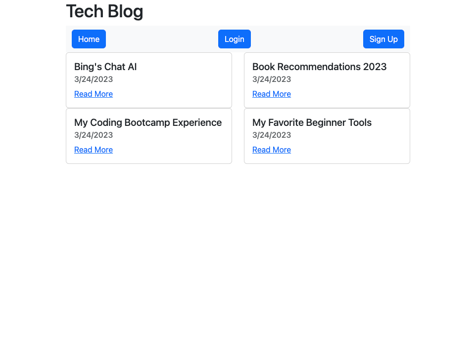

# Tech Blog

## Description

This tech blog app can be used by anyone interested in reading about or writing about tech topics.
Users can create, update, and delete articles from their dashboard, and comment on articles. 

The app encrypts passwords with hashing, so users can sign up securely, using the npm package bcrypt. 
The app follows the MVC structure, using Handlebars.js as the templating language, Sequelize as the ORM, and the express-session npm package for authentication.

## Installation

N/A

## Usage

This app can be used to keep up with current events and opinions in the tech field. 
Users sign up with an email, username, and password that is encrypted. 
Users can create, update, and delete articles from their dashboard. 

[Deployed Website Link](https://quiet-wildwood-59965.herokuapp.com/)

## Credits

I used this resource about html forms: https://www.w3schools.com/html/html_forms.asp

I used this resource about handlebars built-in helpers: https://handlebarsjs.com/guide/builtin-helpers.html#if

## License

Please refer to the license in the repo.
